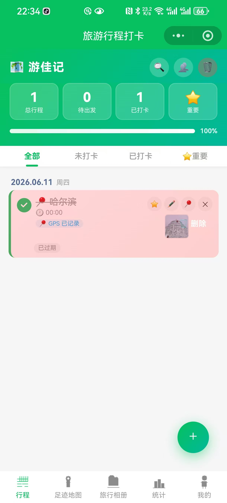
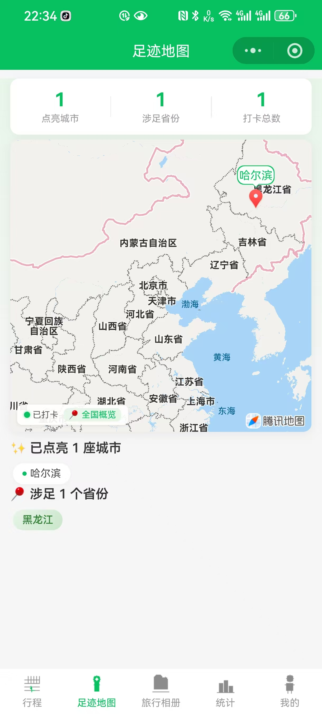
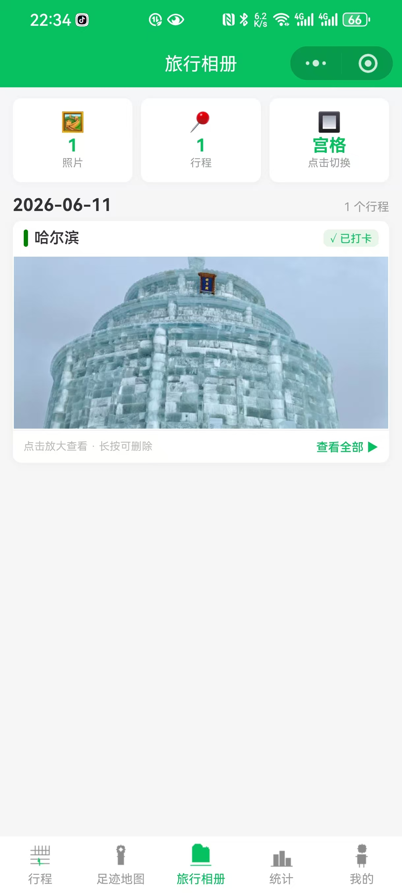
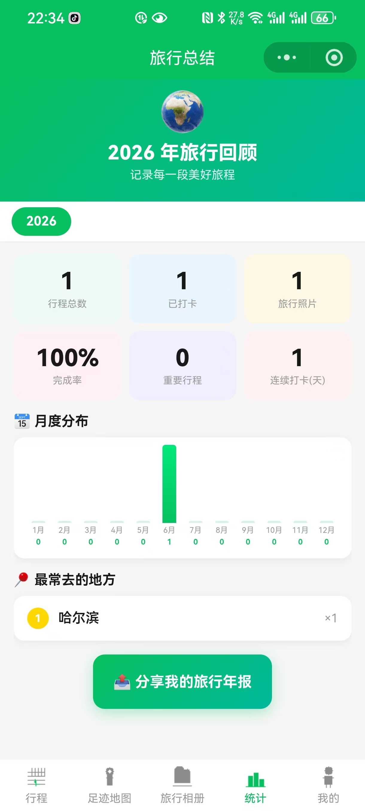
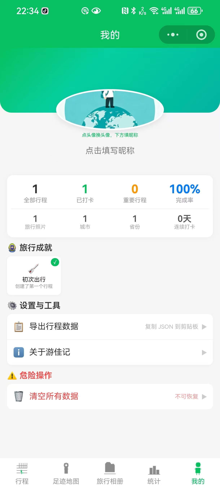

# 🗺️ 游佳记 · 旅行打卡小程序

> 记录旅行足迹，打卡美好瞬间。智能行程管理，照片打卡留念，足迹地图可视化，让每一次旅行都值得珍藏。

## 📱 界面预览

| 行程管理 | 足迹地图 | 旅行相册 |
|:---:|:---:|:---:|
|  |  |  |

| 年度统计 | 个人中心 |
|:---:|:---:|
|  |  |

## ✨ 功能清单

| # | 功能 | 说明 |
|---|------|------|
| 1 | **添加行程** | 地点 + 日期选择器 + 时间选择器 + 备注，保存到列表顶部 |
| 2 | **删除行程** | 卡片 ✕ 按钮弹出确认框；支持**左滑手势**触发删除 |
| 3 | **打卡切换** | 圆形复选框，点击切打卡/取消，已打卡文字显示划线 |
| 4 | **筛选显示** | 全部 / 未打卡 / 已打卡 三个 Tab，带下划线指示器 |
| 5 | **按日期分组** | 自动按日期归组，显示日期 + 星期几 + "今天"标记 |
| 6 | **本地存储** | `wx.setStorageSync` 持久化，关闭小程序数据不丢失 |
| 7 | **统计仪表盘** | 顶部卡片展示：总行程 / 已打卡 / 完成率 |
| 8 | **打卡进度条** | 彩色进度条动态伸缩，CSS transition 过渡 |
| 9 | **行程倒计时** | 每张卡片显示 "还剩 X 天 / 今天出发 / 已过期" |
| 10 | **智能排序** | 未打卡自动排前面，同日期按时间布局 |
| 11 | **照片打卡** | `wx.chooseMedia` 拍照/相册，base64 存储 + 缩略图 + `wx.previewImage` 预览 |
| 12 | **足迹地图** | 全国地图标记已打卡城市，支持 45 座城市坐标匹配，提供景点→城市名智能映射 |
| 13 | **个人中心** | 成就系统、行程统计、数据导出、连续打卡天数 |
| 14 | **颜色主题** | 支持为行程选择多种颜色主题，视觉区分不同类型行程 |

## 🚀 运行步骤

### 1. 注册微信小程序
1. 前往 [微信公众平台](https://mp.weixin.qq.com/) 注册小程序账号
2. 完成实名认证，获取 **AppID**

### 2. 下载微信开发者工具
- 官网：[https://developers.weixin.qq.com/miniprogram/dev/devtools/download.html](https://developers.weixin.qq.com/miniprogram/dev/devtools/download.html)

### 3. 导入项目
1. 打开微信开发者工具
2. 选择 **导入 → 选择文件夹** `D:/code/github/project_3`
3. 填入你自己的 **AppID**（或选择测试号）
4. 点击确定，即可预览和调试

> 当前版本所有数据均存储在本地（`wx.setStorageSync`），无需配置服务器域名。

## 📁 项目结构

```
project_3/
├── app.js                 # 小程序入口
├── app.json               # 全局配置（页面路由/窗口样式/权限）
├── app.wxss               # 全局样式（CSS变量/通用工具类）
├── project.config.json    # 微信开发者工具项目配置
├── sitemap.json           # 站点地图
├── assets/
│   └── check.svg          # 打卡勾选图标
├── pages/
│   ├── index/             # 主页（行程管理）
│   │   ├── index.js       # 主页逻辑
│   │   ├── index.wxml     # 主页模板
│   │   ├── index.wxss     # 主页样式
│   │   └── index.json     # 页面配置
│   ├── map/               # 足迹地图页
│   │   ├── map.js
│   │   ├── map.wxml
│   │   ├── map.wxss
│   │   └── map.json
│   ├── mine/              # 个人中心页
│   │   ├── mine.js
│   │   ├── mine.wxml
│   │   ├── mine.wxss
│   │   └── mine.json
│   ├── album/             # 相册页
│   │   ├── album.js
│   │   ├── album.wxml
│   │   ├── album.wxss
│   │   └── album.json
│   └── detail/            # 行程详情页
│       ├── detail.js
│       ├── detail.wxml
│       ├── detail.wxss
│       └── detail.json
├── utils/
│   └── constants.js       # 常量（颜色主题、省份映射、景点映射）
└── README.md
```

## 🛠️ 技术栈

| 层次 | 技术 |
|------|------|
| 模板 | WXML（数据绑定 / 条件渲染 / 列表渲染） |
| 样式 | WXSS（rpx 响应式 / CSS3 动画 / 渐变） |
| 逻辑 | ES6+（Page 生命周期 / 事件处理） |
| 存储 | wx.setStorageSync / wx.getStorageSync |
| 地图 | `<map>` 组件 + markers 标记点 |
| 媒体 | wx.chooseMedia / wx.previewImage / wx.getFileSystemManager |
| 定位 | wx.getLocation（GPS 打卡） |

## 🔄 与 H5 版的核心区别

| 对比项 | H5 版 (project_2) | 小程序版 (project_3) |
|--------|-------------------|----------------------|
| 运行环境 | 浏览器 | 微信 App 内 |
| 模板语言 | HTML | WXML |
| 样式单位 | px / % | rpx（750rpx = 全宽） |
| 存储 API | localStorage | wx.setStorageSync |
| 相机 API | `<input type="file">` | wx.chooseMedia |
| 弹窗 | 自定义 CSS | wx.showModal / wx.showToast |
| 图片预览 | 自定义 lightbox | wx.previewImage（原生） |
| 日期选择 | `<input type="date">` | `<picker mode="date">` |
| 地图 | 第三方 SDK | `<map>` 原生组件 |

## 📝 上线前 Checklist

- [ ] 注册小程序账号，获取 AppID
- [ ] 替换 `project.config.json` 中的 `appid`
- [ ] 真机调试测试全部功能
- [ ] 提交审核 → 通过后即可发布

## 📄 License

[MIT](https://opensource.org/licenses/MIT) © 2026
